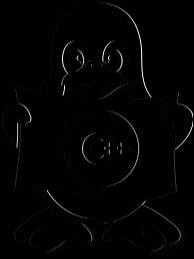
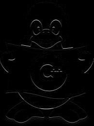
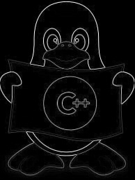
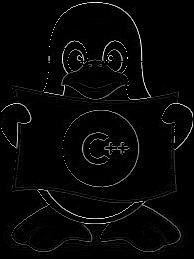
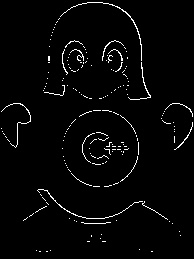
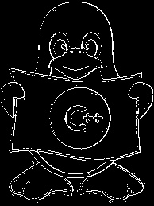
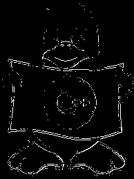
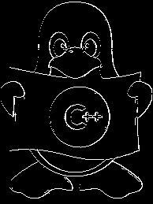
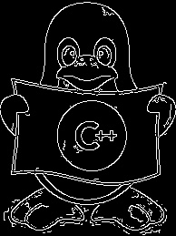

《数字图像处理》

Canny边缘检测

|   姓名   |            李星毅            |
| :------: | :--------------------------: |
|   院系   |     人工智能与自动化学院     |
| 专业班级 | 自动化理工交叉创新实验班1701 |
|   学号   |          U201712072          |
| 指导教师 |         肖阳、陶文兵         |
|   日期   |          2019.11.10          |

## 一、实验环境

- 操作系统：Ubuntu 18.04 LTS
- IDE：Qt Creator (with CMake)
- 第三方库：OpenCV 4.1.1
- 编译器：g++

## 二、实验目的

通过课堂的学习，已经对图像分割的相关理论知识已经有了全面的了解，知道了许多图像分割的算法及算子，了解到不同的算子算法有着不同的优缺点，为了更好更直观地对图像分割进行深入理解，达到理论联系实际的目的，现实现Canny算子

## 三、实验原理

1. Canny算法采用先平滑后求导数的方法，先用高斯模板进行平滑处理，以减弱噪声的干扰
2. 用一阶偏导有限差分计算梯度幅值和方向以获取边缘
3. 利用梯度的幅值和方向对梯度幅值采用非极大值抑制，以减小边缘的宽度，削弱双边缘问题，尽量精确确定边缘的位置
4. 采用双阈值算法检测和连接边缘，减少虚假边缘和轮廓缺失

## 四、实验步骤

### 综述
- 用高斯滤波器平滑图像
- 计算滤波后图像梯度的幅值和方向
- 对梯度幅值应用非极大值抑制，其过程为找出图像梯度中的局部极大值点，把其它非局部极大值点置零以得到细化的边缘
- 用双阈值算法检测和连接边缘，使用两个阈值T1和T2(T1>T2)，T1用来找到每条线段，T2用来在这些线段的两个方向上延伸寻找边缘的断裂处，并连接这些边缘

### 高斯滤波

由高斯滤波器的二维可分性（X 轴与 Y 轴方向进行高斯滤波互不干扰），代码采用两次1\*5一维高斯滤波器$[1, 4, 6, 4, 1]$对 X、Y 方向分别进行卷积（对 Y 方向需要先转置再卷积，之后再转置回来）以实现5*5二维高斯滤波器。由于可将一维高斯滤波器封装为一个函数`SingleGaussFilter`，简化了代码量和程序复杂度

### 一阶偏导有限差分计算梯度幅值和方向

#### 计算梯度

采用算子
$$
\begin{bmatrix}
	-1 & +1 \\
    -1 & +1
\end{bmatrix} \notag
$$
以实现
$$
P[y, x]\approx \frac{1}{2}(S[y,x+1]-S[y,x]+S[y+1,x+1]-S[y+1,x])
$$

$$
Q[y, x]\approx \frac{1}{2}(S[y+1,x]-S[y,x]+S[y+1,x+1]-S[y,x+1])
$$

#### 计算幅值和相角

幅值计算式
$$
M[y, x]=\sqrt{P[y,x]^2+Q[y,x]^2}
$$
相角计算式
$$
\theta[y,x]=arctan\frac{Q[y,x]}{P[y,x]}
$$

### 非极大值抑制

由于得到梯度之后，仍存在双边缘、宽边缘和噪声点等影响，若直接进行阈值分割确定边缘，结果并不理想。为解决宽边缘问题，可以将整条边缘认为是一条山脉，而真边缘则为山脊，故尝试采用局部极大值抑制，只保留3*3邻域且特定方向内的极大值，以消除非山脊的山脉影响

#### 具体措施

- 依据相角$[-90^\circ,+90^\circ]$将梯度角的变化范围减小到圆周的四个扇区之一（$[-22.5^\circ,+22.5^\circ]$对应 0区，$[-67.5^\circ,-22.5^\circ]$对应 1 区，$[+22.5^\circ,+67.5^\circ]$对应 3 区，$[-90^\circ,-67.5^\circ]$和$[+67.5^\circ,+90^\circ]$对应 2区），而每一个扇区对应着当前点 8 邻域的 4 个方向

- 将每一点与沿着梯度线方向的两个象素比较,若当前点梯度值$\geq$沿梯度线的两个相邻象素梯度值，则令保留当前点不变；否则，置 0 

### 双阈值算法检测和连接边缘

由于设置单一阈值，在调节阈值大小的同时,真实边缘的增多往往伴随着虚假边缘和噪声点的增多，而将阈值提高减少虚假边缘和噪声点的同时，会造成边缘轮廓丢失的问题。为解决这个矛盾，采用双阈值分割算法，通过低阈值将所有可能边缘检测出来，利用高阈值检测出所有真边缘（可能有部分轮廓丢失），则可以利用高阈值图像作为种子点，索引出所有在低阈值图像上的所有相邻点，以补全高阈值图像，来实现抑制噪声和虚假边缘，同时减少真边缘丢失的目的

## 五、实验结果与分析

#### 实验结果

原图

灰度图

高斯滤波

X方向梯度

Y方向梯度

梯度

非极大抑制

高阈值梯度图

低阈值梯度图

低高阈值相减梯度图

自己实现的Canny结果

OpenCV Canny

#### 分析

- 将RGB图转成灰度图后进行高斯滤波，发现图片变得有点模糊，有效抑制了噪声点
- 对X方向做一阶偏导有限差分得到竖直方向亮线；对Y方向做一阶偏导有限差分得到水平方向亮线。由这两者算出梯度后，可清晰展现原图像的所有可能边缘
- 采用双阈值分割后，高阈值图像只保留了真实边缘，而且有断裂现象，低阈值图像保留了所有的真实边缘，但是也保留了虚假边缘和噪声等
- 在利用低阈值图像对高阈值图像进行补充后，高阈值图像中的断裂边缘得到恢复，并且虚假边缘和噪声较少
- 第三方库OpenCV得到的边缘更加完整，但是却也引入了很多的噪声和虚假边缘等问题

## 六、实验总结

- 使用OpenCV获取图像像素时，最快的办法时采用ptr即获取图像一行像素值数组的指针，采用指针来对图像像素进行操作
- Canny算子虽然是基于最优化思想推导出的边缘检测算子，实际效果并不一定最优，原因在于理论和实际有许多不一致的地方。该算子同样采用高斯函数对图像作平滑处理，因此具有较强的抑制噪声能力，同样该算子也会将一些高频边缘平滑掉，造成边缘丢失。Canny算子其后所采用双阈值算法检测和连接边缘，采用的多尺度检测和方向性搜索较LOG算子要好