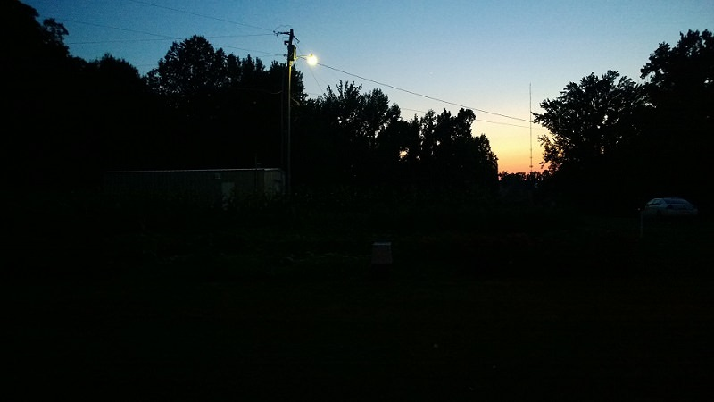
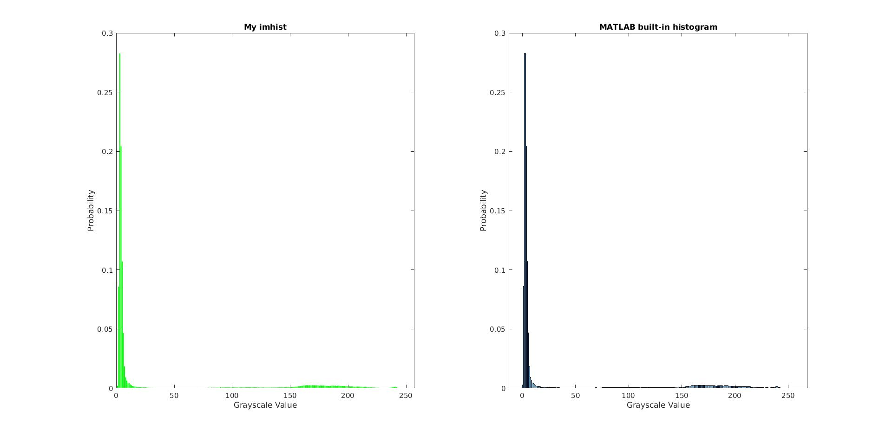
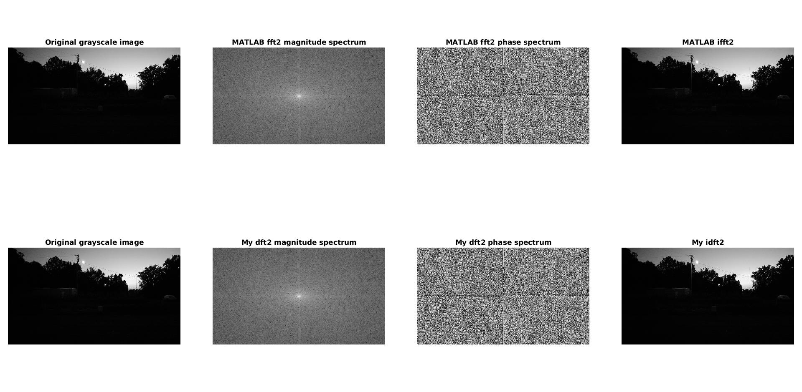
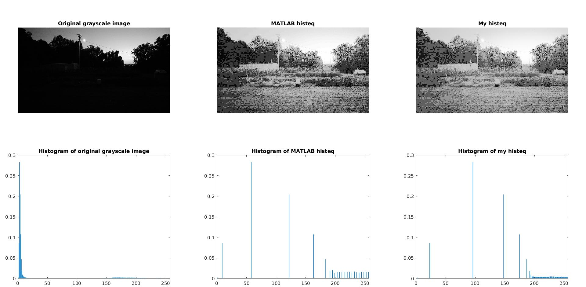
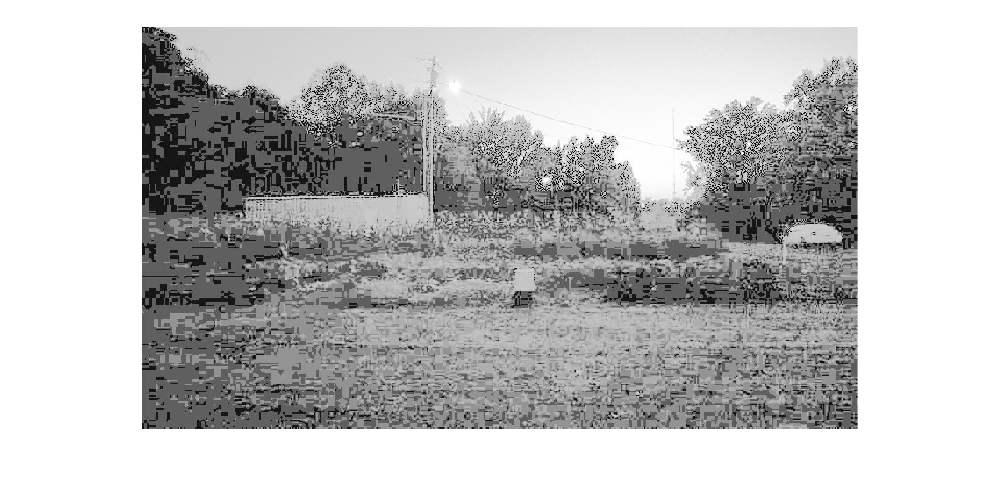
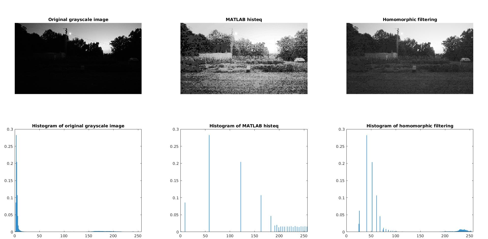
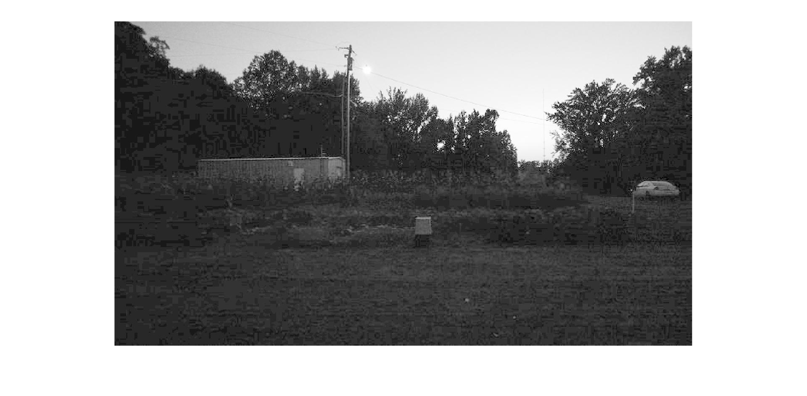
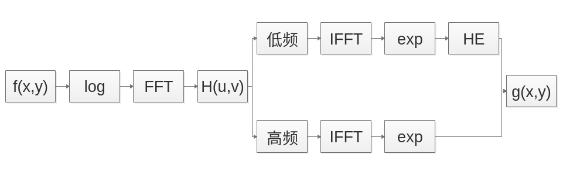
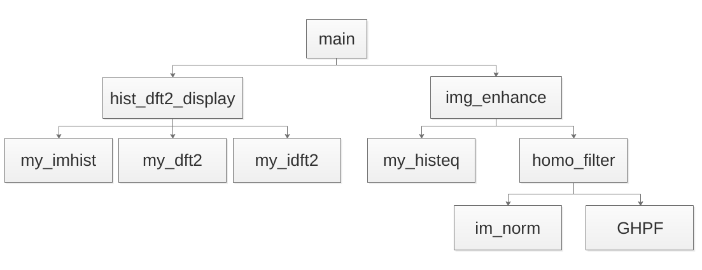

# 数字图像处理编程作业
## 一、作业要求

- [https://pan.baidu.com/s/1OoNeKcPaYOOsxgkYUcBGig](https://pan.baidu.com/s/1OoNeKcPaYOOsxgkYUcBGig)；
- 对上述低照度图像进行灰度化，计算并显示以上低照度图像的灰度直方图和离散傅里叶变换频谱幅度图；
- 对以上低照度图像分别进行直方图均衡化和同态滤波操作，并对两种算法的最终结果进行对比；
- 利用Matlab进行编程，核心算法需独立实现，代码注释不少于40%;

## 二、实验报告

### 任务一

1. 计算并显示灰度直方图my_imhist​

图1：灰度直方图与MATLAB库函数histogram对比

2. 计算并显示离散傅里叶变换频谱幅度图my_dft2 & my_idft2

图2：离散傅里叶变换与MATLAB库函数fft2和ifft2的效果对比

### 任务二

1. 直方图均衡化my_histeq

图3：直方图均衡化与MATLAB库函数histeq的效果对比

图4：直方图均衡化my_histeq的效果图

2. 同态滤波homo_filter

图5：同态滤波与MATLAB库函数histeq的效果对比

图6：同态滤波homo_filter的效果图

## 三、改进尝试

(1) 如果直接对原图进行直方图均衡化，虽然能使图像更明亮，但也放大了噪声；同态滤波增加了图像的亮度，也减少了噪声，但因其增加了低灰度的比例，增强效果仍然不明显

(2) 针对同态滤波与直方图均衡化单独进行图像增强时存在的不足，提出能否在频域内将同态滤波与直方图均衡化结合的想法。首先，采用同态滤波器将图像进行高低分频；再将得到的低频分量进行全局的直方图均衡化处理；最后将高频分量跟低频分量进行线性融合。算法流程图如下：

图7：改进算法流程图

(3) 由于时间比较紧，我没有太多时间去优化这个算法，最终似乎效果并不是太好，所以我就没有展示效果图，这里我仅展示了一个思路

## 四、程序运行

直接在MATLAB中输入运行main即可，整个程序框架如下：

图8：程序框架

