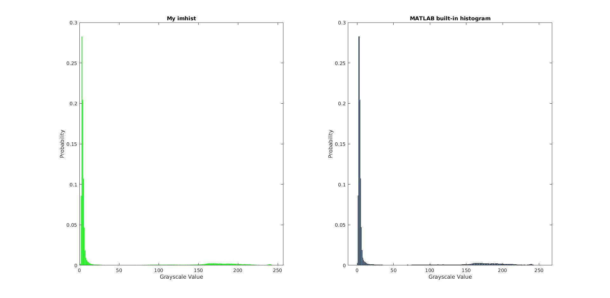
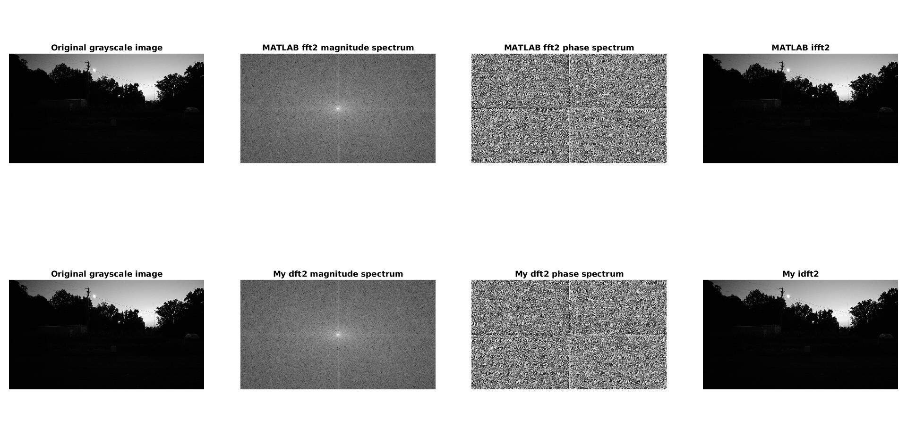

数字图像处理编程作业实验报告

 姓名：李星毅 学号：U201712072 班级：自实1701 

2019.10.12

<left>一、作业要求</left>

- [https://pan.baidu.com/s/1OoNeKcPaYOOsxgkYUcBGig](https://pan.baidu.com/s/1OoNeKcPaYOOsxgkYUcBGig)；

- 对上述低照度图像进行灰度化，计算并显示以上低照度图像的灰度直方图和离散傅里叶变换频谱幅度图；

- 对以上低照度图像分别进行直方图均衡化和同态滤波操作，并对两种算法的最终结果进行对比；

- 利用Matlab进行编程，核心算法需独立实现，代码注释不少于40%；

- 一人一组，2019.10.20前将实验报告和代码发送至

  Yang_Xiao@hust.edu.cn.

<left>二、实验报告</left>  
**任务一**

1. 计算并显示灰度直方图my_imhist​

   实现步骤：

   - 调用MATLAB库函数rgb2gray将图像灰度化
   - 调用自己实现的my_imhist统计每种灰度值出现的次数，并返回概率质量函数
   - 调用MATLAB的库函数bar进行绘制

图1：灰度直方图与MATLAB库函数histogram对比

2. 计算并显示离散傅里叶变换频谱幅度图my_dft2 & my_idft2

   实现步骤：

   - 调用MATLAB库函数rgb2gray将图像灰度化
   - 调用自己实现的my_dft2将计算过程分成两部分，分别对列和对行进行计算，并且采用向量化思想，不使用for循环，极大提高了离散傅里叶变换的计算速度
   - 调用MATLAB库函数fftshift将得到的离散傅里叶变换移动到中心，并取对数，计算幅度和相角后调用imshow显示幅度谱和相位谱
   - 调用fftshift和自己实现的my_idft2进行离散傅里叶逆变换，并调用imshow显示逆变换后的图像

   尝试过程：

   (1) 最开始使用for循环实现课本上离散傅里叶变换二维形式的公式，速度非常慢，原因是该公式的时间复杂度是$O(n^4)$

   (2) 第二次尝试是将离散傅里叶拆分成分别对列和对行进行计算，理论依据是傅里叶变换的交换性，速度有了较好的提升，原因是该公式的时间复杂度是$O(n^2)$

   (3) 第三次尝试是应用向量化的思想，不再采用for循环，而是将计算过程看作是矩阵相乘，极大提高了运算速度

图2：离散傅里叶变换与MATLAB库函数fft2和ifft2的效果对比

**任务二**

1. 直方图均衡化my_histeq

   实现步骤：

   - 调用MATLAB库函数rgb2gray将图像灰度化
   - 调用my_imhist计算输入灰度图的概率质量函数
   - 调用MATLAB库函数cumsum计算累积分布函数并获得原图像灰度值与新图像灰度值映射关系
   - 将获得的映射关系应用在图像上，并计算新图像的概率质量函数

   思考：

   (1) 与MATLAB库函数histeq对比，发现自己实现的书上原始算法与histeq竟然有些不同，可以看到histeq整体偏暗，并且灰度值200以上似乎进行了归并，没有像my_histeq那样这么密集。我推测可能是MATLAB对histeq进行了优化，也许是直方图规定化，也许是其他优化方法

   (2) 还可以看到，虽然直方图均衡化使得该低照度图像的内容能被人眼辨认，但是也同时放大了噪声，效果并不是很理想

   (3) 直方图均衡化的一个优点是参数可以自适应，即不需要调节参数，算法会根据图像的不同而自动调节

图3：直方图均衡化与MATLAB库函数histeq的效果对比

图4：直方图均衡化my_histeq的效果图

2. 同态滤波homo_filter

   实现步骤：

   - 调用MATLAB库函数rgb2gray将图像灰度化
   - 取对数，并使用my_dft2进行离散傅里叶变换
   - 调用自己实现的高斯高通滤波GHPF并作用在经离散傅里叶变换的图像上
   - 使用my_idft2进行离散傅里叶逆变换，并取指数
   - 重新调整成灰度图，使用imshow显示

   思考：

   (1) 同态滤波的效果明显好过直方图均衡化，没有这么刺眼，也没有这么多噪声

   (2) 同态滤波的缺点是参数需要根据图像的不同来调节高通滤波器的参数，不能做到自适应

图5：同态滤波与MATLAB库函数histeq的效果对比

图6：同态滤波homo_filter的效果图

<left>三、改进尝试</left>  
(1) 如果直接对原图进行直方图均衡化，虽然能使图像更明亮，但也放大了噪声；同态滤波增加了图像的亮度，也减少了噪声，但因其增加了低灰度的比例，增强效果仍然不明显

(2) 针对同态滤波与直方图均衡化单独进行图像增强时存在的不足，提出能否在频域内将同态滤波与直方图均衡化结合的想法。首先，采用同态滤波器将图像进行高低分频；再将得到的低频分量进行全局的直方图均衡化处理；最后将高频分量跟低频分量进行线性融合。算法流程图如下：

图7：改进算法流程图

(3) 由于时间比较紧，我没有太多时间去优化这个算法，最终似乎效果并不是太好，所以我就没有展示效果图，这里我仅展示了一个思路

<left>四、程序运行</left>  
直接在MATLAB中输入运行main即可，整个程序框架如下：

图8：程序框架

